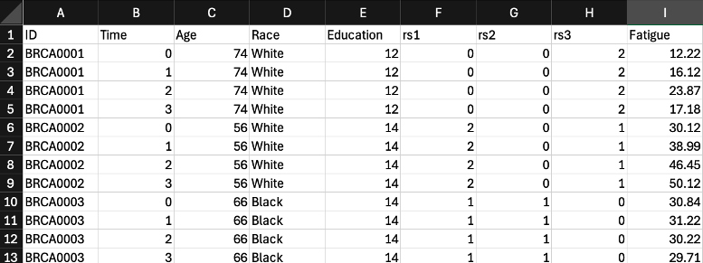

```{r,echo=FALSE,message=FALSE,warning=FALSE}
require(knitr)
# Set so that long lines in R will be wrapped:
opts_chunk$set(tidy.opts=list(width.cutoff=80),tidy=TRUE)
```

```{r,echo=FALSE}
# In the event of a crash, save the working space on exit:
save_all <- function() {
  save.image("recover.RData")
}
options(error = save_all)
```

This document was created in collaboration with ChatGPT 5 to support a 2025 ISONG lecture:           

*Heinsberg LW. Partnering with AI for Genomic Informatics: Practical Workflows for Data Analysis and Interpretation. [Expert Lecture, Podium]. International Society of Nurses in Genetics, November 2025, Montreal, Canada.*          

The author (Dr. Lacey W. Heinsberg) drafted the scientific content herself and used ChatGPT 5 for language editing, organization, and formatting suggestions only. She reviewed, revised, and edited all content, and takes full responsibility for the final product.          

# Copyright

Copyright 2025, University of Pittsburgh. All Rights Reserved. License: GPL-2

# Scenario 

Imagine we are a research team studying individuals with breast cancer. We have collected longitudinal symptom data (fatigue, pain, sleep, cognition) and SNP genotype data for each participant. Our paper’s aim is:

Determine whether genetic variation in the ABC gene is associated with fatigue over time.

Our data look like this:

{width=60%}

*Note: This is not real data; for the purposes of this guide, please treat it as illustrative.*

We brief our graduate student and authorize analysis as a human–AI partnership:

{width=60%}

The examples below show prompts that reflect ethical, guided interactions with AI (coach, not decision-maker; no real data shared).

# Review code of conduct 
         
Before beginning, we review our lab’s code of conduct for responsible AI collaboration:                           
              
1. **Build competence before reliance**: prioritize understanding statistical and programming concepts before using AI-generated code.         
2. **Respect data privacy**: never upload human participant data (even if de-identified) into AI systems.        
3. **Maintain objectivity**: critically evaluate AI suggestions and outputs.          
4. **Enhance communication**: use AI to improve clarity, accessibility, and aesthetics of data visualizations and statistical reporting.          
5. **Be transparent**: disclose any AI involvement in code development, analysis, or figure generation.             
6. **Revisit ethics and policy**: regularly refine AI practices in alignment with institutional policies and responsible science.        

**Key reminders**  

* Never paste real data — use synthetic only        
* We remain the humans in the loop (AI supports reasoning, not the other way around)                   

# Data analysis process 

## Step 1: Discussion and planning 

**Goal**: before coding, articulate reasoning and use AI as a coach, not a decision-maker.

**Mindset**

* I’m checking my own reasoning, not asking AI what to do.
* Keep it conceptual; no raw data (ever) and no synthetic data yet.

### Describe the project and preliminary plan 

* Define outcome, predictors, covariates.
* Explain study structure (e.g., longitudinal).
* Identify known challenges (missingness, within-subject correlation).
* Stay conceptual—no real data.
* Articulate your initial analysis idea before asking for help.
* Be honest about uncertainty; make your reasoning visible.

> **EXAMPLE PROMPT**  
> *Let me describe my dataset conceptually: outcome = continuous fatigue (0–50) at 4 time points; predictors = rs1–rs3 (0/1/2); covariates = age, race, education. My plan is to analyze associations between genetic variation in the ABC gene and fatigue over time.*
> *Because fatigue is continuous, I think linear regression fits… but since it’s repeated, maybe mixed models? I’m weighing cross-sectional (exploratory) vs a longitudinal approach. Can we talk through trade-offs in plain terms?*

### Stress-test the plan

* Ask AI to challenge your logic and surface assumptions/limitations
* Still conceptual—no code yet
* Think through output
* Read AI’s points, reflect, reassess, and revise
* Capture your new reasoning in short notes
(no specific prompt here; this is your thinking pass)

> **EXAMPLE PROMPT**  
> *If I model fatigue with a linear mixed model, what assumptions am I making about correlation and missing data? Where could this approach break?*

* Push for alternatives
* Explore “what else could work?” and compare models and trade-offs
* Capture pros/cons for each option

> **EXAMPLE PROMPT**  
> *If I don’t use a mixed model, what are realistic alternatives for repeated, continuous outcomes? Please compare LMM vs GEE vs repeated-measures ANOVA in plain terms—what does each estimate, and when is each preferable?*

### Test knowledge

* Use AI as a quiz engine to check concepts and fix misconceptions.

> **EXAMPLE PROMPT**  
> *Quiz me on the key differences between fixed and random effects—5 multiple-choice items. Explain any I miss in plain language.*

### Synthesize and decide

* Summarize what you learned; choose a primary approach and why
* List open questions to check with a mentor/biostatistician

> **EXAMPLE PROMPT**  
> *Here’s my current decision: I’ll use a linear mixed model with random intercepts because ____. Summarize my reasoning in 3 bullets I can review with my team.*

### Check with outside sources

* Biostatistician / statistician
* CrossValidated (StackExchange) / Stack Overflow
* Textbooks / trusted references
* Simulation checks
(no AI prompt required; this is human verification)

### Develop a one-page analytical proposal

* Summarize: purpose, sample, approach, assumptions, alternatives, decisions not taken (why)
* This is your bridge to coding and supports transparency/pre-specification
* See the example one-page analytical proposal [here](ExampleAnalysisPlan.docx)

> **EXAMPLE PROMPT**  
> *Draft a one-page analysis concept note from our discussion. Include purpose, data structure, chosen model, assumptions, one alternate approach, and a section for methods considered but not chosen (with reasons).*

**A special note** about asking generative AI to draft content: typically I do *not* ask AI to generate my scientific writing — that is part of my intellectual contribution as a researcher. However, *in this specific case*, I would consider asking AI to help structure my own reasoning into an outline — because:

(1) I am asking for a **structured outline** / summary of my reasoning, articulated mostly from myself
(2) I am using AI as a **secretary / note-taker** to capture that reasoning in a structured, one-page format

I am still the scientist — AI is simply helping me organize my own thinking.

## Step 2: Share the plan with the team (pre-specification)

Before any code runs — we **share our one-page analytic proposal** with the team.

What gets shared:

* Co-author names 
* Background/aims
* Analytical plan 

See example here. 

We explicitly *invite red ink* — revision is the point. While many groups skip this step, pre-specification increases transparency, teamwork, and trust. Also --- **if you can’t write down your plan clearly enough for collaborators to agree on it, you’re not ready to analyze yet.** Once everyone’s voice is incorporated, the plan becomes our plan.

Then (and only then) do we start coding.

## Step 3: Start to code

FINALLY! (But synthetic data only)

### Project hygiene

Before starting, get your project set up to stay organized! 

* Create an RStudio Project for this analysis
* Make folders: data/, scripts/, figures/, output/
* Use clear file names and version by date
* Open template, file it out, outline (add project description and outline your template (copy and paste final analytical proposal key details))
* Get feedback from AI

> **EXAMPLE PROMPT**  
> This is my markdown analysis template that i am planning - what am I missing.  analysis outline (Table 1 → plots → LMM → tidy/interpret). What key steps am I missing for a simple, defensible longitudinal pipeline? Don’t write code—comment conceptually.

### Create syntehtic data to start building code

* Rule #1: never use real participant data while developing; build the full pipeline on synthetic data first
* Ask ChatGPT or other generative AI to give you R code to simulate data that matches your real data 
* Optional: Use custom Gem (Gem instructions linked [here](SyntheticDataGemInstructions.txt))

**SIDEBAR: How to copy my custom Gemini "Gem"**

(1) Open Gem instructions linked [here](SyntheticDataGemInstructions.txt)
(2) Go to Google Gemini and click "Explore Gems" 
(3) Click "+New Gem"
(4) Give it a name, description, and paste the gem instructions (from (1) above) into the instructions field 
(5) Click "Save"

**END SIDEBAR**

> **EXAMPLE PROMPT**
> Generate fully executable R code to simulate a long-form, non-identifiable longitudinal dataset for 500 participants at 4 time points (0,1,2,3). Variables: ID (e.g., BRCA0001), Time (factor), Age (55–80), Race (White/Black ≈ 80:20), Education (10–20, right-skewed), SNPs rs1/rs2/rs3 (0/1/2 under HWE with MAFs .25/.10/.33), and Fatigue (0–50). Add a strong positive association between rs1 and both higher baseline fatigue and a steeper increase over time. Return a tibble named df_long; do not write files.

Example code output from custom [Gem]((SyntheticDataGemInstructions.txt): 

```{r, warning=FALSE, message=FALSE}
# Chunk generated by Lacey Heinsberg's Synthetic_Data Gemini Gem
# A Senior Bio-Statistician's Synthetic Data Simulation Protocol
# Language: R
# Objective: Generate a long-form (longitudinal) dataset (N=500, T=4)

# Load necessary libraries
if (!requireNamespace("dplyr", quietly = TRUE)) {
    install.packages("dplyr")
}
if (!requireNamespace("tidyr", quietly = TRUE)) {
    install.packages("tidyr") # tidyr is needed for expand_grid
}
library(dplyr)
library(tidyr) # Make sure tidyr is loaded

# Set a random seed for reproducibility
set.seed(42)

# 0. Define Required Parameters (The missing pieces)
N_participants <- 500
T_time_points <- 4
time_points <- 0:(T_time_points - 1) # Define Time points (e.g., 0, 1, 2, 3)

# Minor Allele Frequencies (MAF) for SNPs
MAF_rs1 <- 0.25
MAF_rs2 <- 0.10
MAF_rs3 <- 0.33

# Baseline mean for the Fatigue outcome
Fatigue_mu_baseline <- 15

# Calculate Education components *before* creating the data.frame ---
# Calculate Education_raw
Education_raw_calc <- rbeta(N_participants, shape1 = 2, shape2 = 5)

# Calculate Education
Education_calc <- round(10 + Education_raw_calc * 10)
# Enforce range 10-20
Education_calc <- pmin(pmax(Education_calc, 10), 20)

# --- 1. Generate Baseline/Time-Invariant Data (N=500) ---
df_base <- data.frame(
    # Unique Participant ID
    ID = sprintf("BRCA%04d", 1:N_participants),
    
    # Continuous Variable: Age (Uniform 55-80)
    Age = round(runif(N_participants, min = 55, max = 80)),
    
    # Categorical Variable: Race (80% White)
    Race = sample(c("White", "Black"), N_participants,
                  replace = TRUE, prob = c(0.80, 0.20)),
    
    # Continuous Variable: Education (10-20, Right-Skewed, Median ~14)
    Education = Education_calc,
    
    # SNP Generation (Assuming Hardy-Weinberg Equilibrium - HWE)
    # Genotype (0, 1, 2) is the sum of two independent Bernoulli(MAF) trials.
    rs1 = rowSums(replicate(2, rbinom(N_participants, 1, MAF_rs1))),
    rs2 = rowSums(replicate(2, rbinom(N_participants, 1, MAF_rs2))),
    rs3 = rowSums(replicate(2, rbinom(N_participants, 1, MAF_rs3)))
)

# --- 2. Expand to Long Form (N * T = 2000) ---
df_long <- df_base %>%
    tidyr::expand_grid(Time = time_points) %>%
    # Arrange by ID then Time for proper longitudinal structure
    arrange(ID, Time)

# --- 3. Simulate Longitudinal Outcome: Fatigue (Introducing Association) ---

# Create within-subject noise component (for residual error)
# Note: In a proper LMM simulation, you might want subject-specific random effects, 
# but for this simple protocol, the existing error term is fine.
df_long$Error_Subject <- rnorm(nrow(df_long), mean = 0, sd = 5)

# Calculate the Fatigue outcome based on a strong linear mixed-effects model
# Model structure:
# Baseline_Mean + Effect_rs1 + General_Time_Trend + rs1_Time_Interaction + Error
df_long <- df_long %>%
    mutate(
        # Base mean for Fatigue, accounting for the rs1 effect at Time=0 (Intercept)
        Fatigue_Base = Fatigue_mu_baseline + (3 * rs1),
        
        # Introduce a general, slight worsening over time (0.5 units/time)
        Time_Effect_General = Time * 0.5,
        
        # *** Introduce the Strong rs1 x Time Interaction ***
        # rs1=2 individuals get an *additional* 5 points of worsening per time step
        Time_Effect_rs1_Interaction = Time * 5 * (rs1 == 2),
        
        # Final Fatigue calculation
        Fatigue = Fatigue_Base + Time_Effect_General +
                  Time_Effect_rs1_Interaction + Error_Subject
    ) %>%
    # Clip Fatigue to the specified 0-50 scale
    mutate(
        Fatigue = pmin(pmax(Fatigue, 0), 50),
        Time = factor(Time) # Convert Time to a factor for analysis
    ) %>%
    # Select final columns and drop intermediate ones
    select(ID, Time, Age, Race, Education, rs1, rs2, rs3, Fatigue)

# View final data set 
head(df_long)
```

### Build code in small, testable chunks

* Write a little → run it → check output
* When stuck, ask AI for targeted help (not a full rewrite)
* Keep a short log of your AI interactions (good documentation + learning record)

Targeted prompt examples include: 

> **EXAMPLE PROMPTS**               
> DRAFTING                 
> Write tidyverse code to create Table 1 with age, Race, Education, and rs1–rs3 distributions.

> DEBUGGING                 
> I get object not found after this line: df_long %>% filter(Time == 0). What’s wrong?

> REFINING                 
> This loop works but is clunky. Can you rewrite it using dplyr without changing the logic?

> ANNOTATING                 
> Add lay-language comments to this R code and mark where users should customize names/models.

> EXPLAINING                 
> Here’s my model summary. Walk me through what each estimate means, including reference levels, in plain English.

> UNDERSTANDING                 
> Why did adding a random slope change convergence? Explain conceptually, not with code.

> VISUALIZING                 
> Draft a clear ggplot of mean fatigue over time by rs1 (0/1/2), with points and lines, labeled axes, and a legend.

**Ethics reminder (while coding)**

* Never paste real rows/values or screenshots of real data into AI.
* Share only errors, variable names, and non-identifiable structure.
* Use AI as a collaborator, not a crutch — your brain drives the science.

Examples follow.

Example: Core modeling & plotting

> **EXAMPLE PROMPT**
Let's get started! You already know my data structure. I know I need to use the lme4 package. Give me R code to fit a very basic linear model as an example. Annotate it in lay terms so I can learn every step.

```{r, warning=FALSE, message=FALSE}
# Load required packages (this adds functions for mixed models)
if (!requireNamespace("lme4", quietly = TRUE)) install.packages("lme4")
if (!requireNamespace("lmerTest", quietly = TRUE)) install.packages("lmerTest")

library(lme4)       # core mixed model functions
library(lmerTest)   # adds p-values + Satterthwaite df to lme4

# Fit the linear mixed model
# Lay language:
# We are estimating whether rs1 genotypes are associated with fatigue,
# whether fatigue changes over time, and whether rs1 changes that trajectory.
# We also include Age, Race, Education as covariates (potential confounders).
# (1|ID) = each person gets their own “starting point” (random intercept).
m1 <- lmer(
  Fatigue ~ rs1 * Time + Age + Race + Education + (1 | ID),
  data = df_long
)

# View model results (effect sizes, SE, df, p-values)
summary(m1)
```

> **EXAMPLE PROMPT**
Please give me R code to draft a simple figure plotting fatigue over time by genotype. 

```{r}
if (!requireNamespace("tidyverse", quietly = TRUE)) install.packages("tidyverse")
library(tidyverse)

df_long %>%
group_by(Time, rs1) %>%
summarise(
mean_fat = mean(Fatigue),
se = sd(Fatigue)/sqrt(n()),
.groups = "drop"
) %>%
ggplot(aes(x = Time, y = mean_fat, group = rs1)) +
geom_line() +
geom_point() +
geom_errorbar(aes(ymin = mean_fat - se, ymax = mean_fat + se), width = 0.1) +
labs(
title = "Mean Fatigue Over Time by rs1 Genotype (0/1/2)",
x = "Time",
y = "Mean Fatigue (0–50)"
)
```


Etc. Etc! Continue to interact with your GPT like this! 

## Step 4: Swap in the real dataset

### Read in the real data

Turn OFF the simulation code chunk.
Turn ON the chunk that reads your real dataset.

Do not rewrite your analysis code — just re-run the exact same workflow.

(This step is not shown here because this is a synthetic demo.)

In theory, this works because we built all of our code using synthetic data first — but we made sure the synthetic dataset had the exact same:

* variable names (e.g., Fatigue, rs1, Education)
* data types (numeric vs factor)
* structure (long-form: one row = one person at one time)
* time points (0,1,2,3)

That means our code is not written for a specific file — it is written for a data structure. So when we swap in the real data, the code doesn’t know anything changed — it just runs. 

### Debug 

In theory: everything should run without modification.
In practice: real life always contains surprises - this is normal.

This is where debugging comes in — but you are debugging a nearly finished pipeline (built on synthetic data), instead of inventing the pipeline while touching real data. This protects privacy and saves time. When something breaks — you can share the code and error message with AI (or with a colleague) and ask for help.
Never share real data rows, values, or screenshots.

Common break points (and what to check first):

* Column types mismatch (e.g., in real data rs1 is a character (“0”, “1”, “2”) but in synthetic it was numeric (0,1,2)) 
* Missing codes (e.g., real data uses -9999 or "" instead of NA, fix these first) 
* Factor order (e.g., in real data Time comes in as character; convert to ordered factor (0 < 1 < 2 < 3)) 
* Out-of-range values (e.g., Fatigue values >50; genotype not 0/1/2,  flag these0 
* Duplicates or missing ID×Time combinations (e.g., someone is missing a time point, or has two T2 rows) 
* Encoding differences (e.g., Sex is "female" in real data instead of "Female" used in synthetic)

> **EXAMPLE PROMPT**
> Here is my code and here is the error message. What is this error telling me? Suggest 1–2 ways to fix it conceptually (no code rewrite).

## Step 5: Interpret results

AI can help translate statistical output into plain language — but **you** interpret meaning.

```{r}
# View model results (effect sizes, SE, df, p-values)
summary(m1)
```

> **EXAMPLE PROMPT**
Translate the fixed effects from this summary into 3-4 plain-English sentences. Specify reference levels and what a positive rs1:Time estimate means.

AI Translation: In this model, Time=0 and rs1=0 are the reference groups. At baseline (Time=0), people with rs1=1 or rs1=2 already have higher fatigue than rs1=0 (that’s the positive main effect for rs1). The rs1×Time interaction terms mean that as time goes on, the fatigue gap between rs1 carriers and non-carriers gets bigger — they not only start higher, they worsen faster. In other words: rs1 is associated with both higher baseline fatigue and a steeper increase in fatigue over time.

**IMPORTANT:** AI can decode numbers into English. We decide what those numbers mean for health, patients, and our science.

## Step 6: Summarize & share

* Ensure the code runs cleanly end-to-end.
* Knit your R Markdown (or Quarto) to a clean report.
* Then share your markdown, or build a results presentation to share out!

**Most importantly:** this is where YOU (or depending on your level of expertise, a mentor / collaborator / biostatistician) must review the code, line by line.
Even if AI helped scaffold some pieces — AI does not validate correctness. You do.

Analysis is not done when the code runs - its done when US HUMANS have reviewed/approved it! 

Then continue on with the scientific process!

# Wrap up 

## Partnering with AI: Core principles

* reproducibility starts with R/Quarto
* partner with AI thoughtfully
* build competence before reliance
* use synthetic data to learn / code safely
* swap in real data only after approval & QC

Does AI make us less scientific? 
Or does it help us spend more time being scientists? 
AI is here to stay. Let’s use it to our advantage.

## A note about learning + AI

If your goal is to *truly learn to code* — then you should minimize generative AI use. Tressie McMillan Cottom [(NYT, Aug 12, 2025)](https://www.nytimes.com/2025/08/12/opinion/ai-college-classrooms-chatgpt.html) warns that if AI automates the messy parts — we lose the foundational learning that comes from wrestling with problems, making mistakes, and figuring out why code fails. [Andrew Heiss](https://datavizf24.classes.andrewheiss.com/resource/ai-bs.html) similarly notes that LLMs produce plausible code — but not necessarily correct code. And [Dan Weeks](https://danieleweeks.github.io/HuGen2071/LLMs.html) emphasizes that relying on AI before you understand the underlying logic hollows out the learning process — because you cannot evaluate whether the output is right, wrong, incomplete, or misleading.

As I mention in my presentation, the decision to use AI is deeply personal. I think it depends on your career stage and your goals:

* If your goal is learning and building competence: write the code yourself. DO NOT use AI --- or use it only sparingly when you are stuck.
* If your goal is efficiency once you are already competent: then AI can help scaffold, outline, or speed formatting and setup — it should not replace your judgment.

This is not "OK for me but not for you." This is about not cheating yourself out of the learning you actually want/need. 

## Thank you! 

Thanks for reading this and for being part of a scientific culture that values transparency, rigor, and learning.

If you have questions or want to adapt this workflow for your team, feel free to reach out:
law145@pitt.edu

# Generative AI Disclosure

This document was developed in partnership with ChatGPT-5. All scientific ideas, study design, and analytic decisions were generated by the author. ChatGPT-5 was used only to support language editing, organization, formatting, and to draft template text that the author reviewed and revised. The author takes full responsibility for the final content.

# Session Information

```{r session}
sessionInfo()
```

